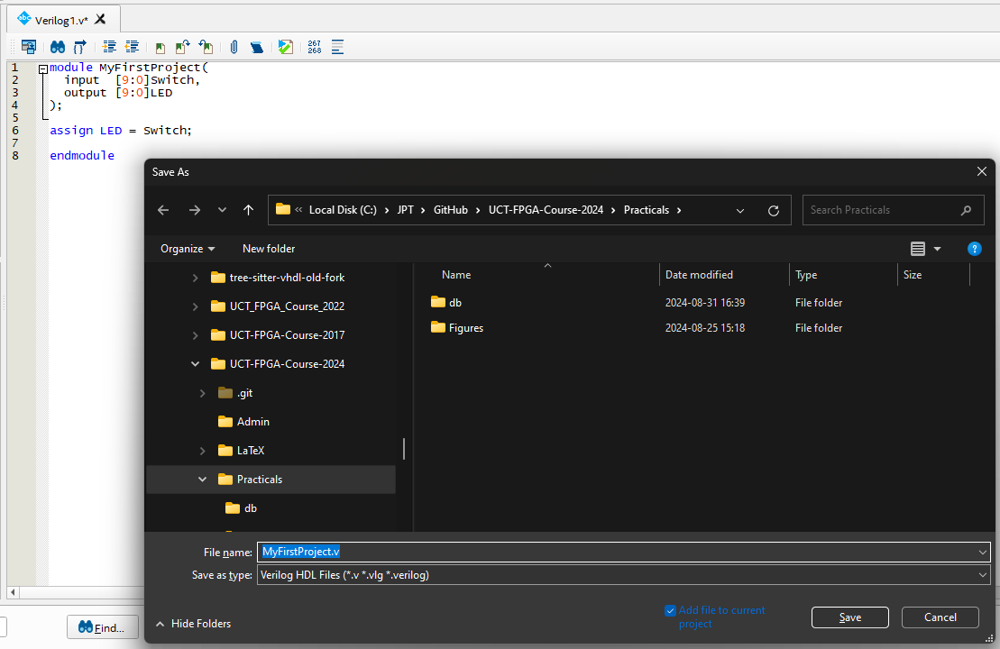

# Tutorial &ndash; Quartus

Prerequisite: Day 1 lectures

- Creating and setting up a new project (from scratch)
- Compiling the design and programming the device
- **Note:** The Lab is re-imaged daily, so remember to save your project somewhere else at the end of the day

--------------------------------------------------------------------------------

## Open up the Quartus IDE

After starting Quartus, you should see a screen similar to the following:


### Familiarise yourself with the toolbar


--------------------------------------------------------------------------------

## Open the new project wizard


### Choose "Empty Project"


### Add existing files (if you have existing ones)


### Choose a device


**NOTE**: You have to actually select the device, not only reduce the list.

### Or choose a board


If you cannot find the DE10-Lite in the list, you'll need to install the
[Baseline Pinout](https://www.intel.com/content/www/us/en/design-example/714490/intel-max-10-fpga-terasic-de10-lite-board-baseline-pinout.html)
project from the Altera website.

For today &ndash; use the "Choose a Device" option.

### Configure 3rd party tools


### Verify the summary


### Finish generating the project

The project tree should now look like this:


--------------------------------------------------------------------------------

## Configure the device settings


### Verify correct device and pin options


### Enable memory initialisation


### Set unused pins to tri-state


### Set the default I/O standard


### Ensure that generated files are in a sub-folder


### Set the compiler optimisation mode


### Change the VHDL version to 2008


### Change the Verilog version to SystemVerilog


--------------------------------------------------------------------------------

## Create a top-level module


Fill it with the simple example below:

```systemverilog
module MyFirstProject(
  input  [9:0]Switch,
  output [9:0]LED
);

assign LED = Switch;

endmodule
```

## Save the top-level module



--------------------------------------------------------------------------------

## Pin Assignments

Before setting the pin assignments, you have to run Analysis and Elaboration:


### Open the Pin Planner


Ensure that the pins numbers are correctly taken from the DE10-Lite manual.
Also make sure that the I/O standard, current strength, etc. are correct.

### Easier Pin-assignments...

Manual pin assignment is a tedious process, so it is useful to become familiar
with the Quartus Settings File format so you can automate the process.

Copy the pins from the PDF manual into Excel or a text file or whatever tool
you like that will allow you to do bulk editing.  Then get the pin assignments
in a form that allows you to copy and paste the commands.  For example:


And then in the QSF file:

```tcl
set_location_assignment PIN_C10 -to Switch[0]
set_location_assignment PIN_C11 -to Switch[1]
...

set_location_assignment PIN_A8 -to LED[0]
set_location_assignment PIN_A9 -to LED[1]
...

set_instance_assignment -name IO_STANDARD "3.3-V LVTTL" -to Switch
set_instance_assignment -name IO_STANDARD "3.3-V LVTTL" -to LED
```

### Other Pin Properties

Other pin properties you need to be aware of include:

- Use a slow slew-rate to limit bandwidth on long lines
- Use a fast slew-rate for time-critical signals
- Use a high drive strength for LEDs
- Use a high drive strength for pins that are higher speed and / or capacitively loaded
- Use a low drive strength when saving power is required (also limits the bandwidth)
- The MAX-10 supports Schmitt-triggered inputs

--------------------------------------------------------------------------------

## Run a full compilation


Note the red "Timing Analyser" report... We'll worry about that later...

--------------------------------------------------------------------------------

## Program the FPGA

- Plug in the DE10-Lite and open the Programmer Window
- Make sure the "Hardware Setup" says "USB-Blaster"
- If you cannot select the USB-Blaster from the list of hardware devices,
  you'll need to update the driver &ndash; point your Device-Manager's
  "Update Driver" wizard to `C:/intelFPGA_lite/23.1std/quartus/drivers`
- Click on "Add File..." and choose `output_files/MyFirstProject.sof`
- Click on "Start" to program the FPGA
- Play with the switches to make sure your design is working
- The SOF is volatile.  If you're happy with the design and want to make it
  non-volatile, choose `output_files/MyFirstProject.pof` instead.

### Save the configuration


--------------------------------------------------------------------------------
