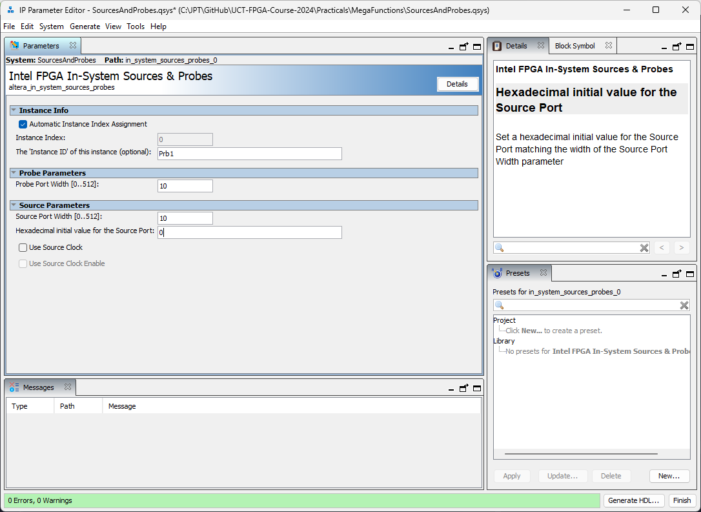

# Tutorial : Source and Probes

Prerequisite: Day 1 lectures

JTAG-based debugging tools


--------------------------------------------------------------------------------

## Open the IP Catalogue

The IP Catalogue is used to create wrapper modules for:

- Internal RAM,
- Phase-locked loops
- DDR controllers
- PCIe controllers
- DSP modules
- ADC modules
- etc.

More about that later.  For now, choose Sources and Probes:


### Name your new IP Variation


### Set the parameters



### Generate the HDL


### Add the resulting QSys file to the project


### Open the auto-generated wrapper


You should see a Verilog file that contains, among other details:

```systemverilog
module SourcesAndProbes (
  input  wire [9:0] probe,  // probes.probe
  output wire [9:0] source  // sources.source
);
```

This can be copied and pasted to instantiate the module.

### Instantiate the module

In your top-level module (i.e. `MyFirstProject.v`), add the instantiation:

```systemverilog
wire [9:0]Source;
SourcesAndProbes SourcesAndProbes_inst(
  .source(Source),
  .probe (Switch)
);
assign LED = Switch ^ Source;
```

Quartus might complain about multiple drivers on the LED nets &ndash; I'll let
you figure out how to solve that one.

### Direct Option

You can also instantiate the IP Block directly (i.e. without using the wizard).
You should consult [the manual](https://www.intel.com/content/www/us/en/programmable/quartushelp/23.1/index.htm?q=/content/www/us/en/programmable/quartushelp/23.1/hdl/mega/mega_file_altsource_probe.htm)
if you'd like to follow this route.  The resulting instantiation in your
top-level module would look similar to:

```systemverilog
wire [9:0]Source;

altsource_probe #(
  .instance_id             ("Prb1"),
  .sld_auto_instance_index ("YES"),
  .probe_width             (10),
  .source_width            (10)
)SourcesAndProbes_inst(
  .source_ena(1'b1),
  .source    (Source),
  .probe     (Switch)
);

assign LED = Switch ^ Source;
```

--------------------------------------------------------------------------------

## Use the Sources and Probes feature to control the FPGA

Compile and program the FPGA, then open the "In-System Sources and Probes Editor":


It might complain about "No instances found in the current project or on the device".  You can safely ignore this.

Select the instance you want to connect to ("Prb1" in this case), then click
the "Continuously Read Probe Data" toolbar icon: 

Change the slide-switches to see the probes update, and click on the source
bits to control the LEDs.


--------------------------------------------------------------------------------

