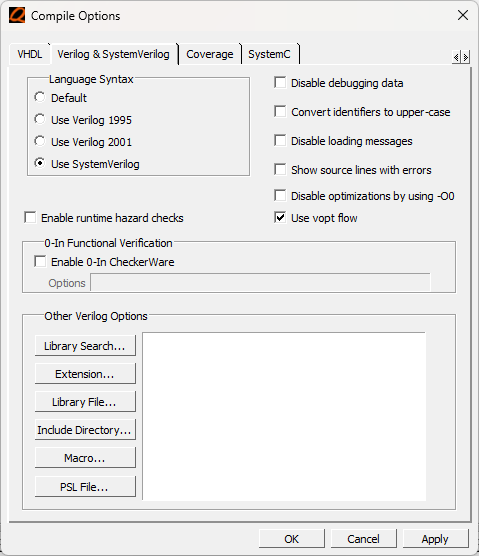
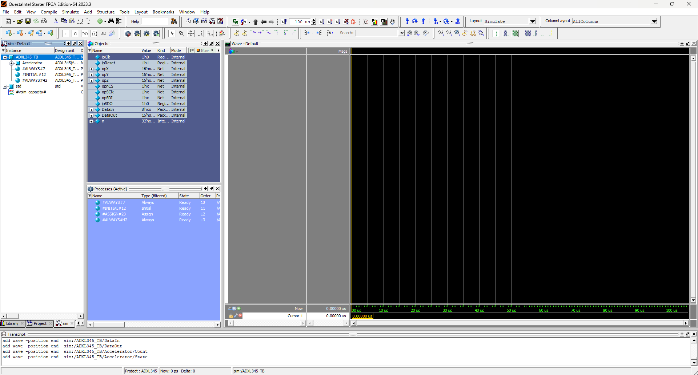
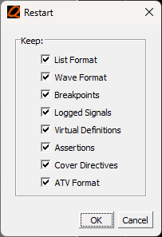

# Tutorial &ndash; Questa

Prerequisite: Day 2 lectures

This tutorial deals with simple simulation,
i.e. only a single module with its test-bench.


--------------------------------------------------------------------------------

## We'll use the ADXL345 module from the lectures

```systemverilog
module ADXL345 #(
  parameter Clock_kHz,
  parameter Baud_kHz = 5000
)(
  input ipClk, ipReset,

  // 2's Compliment Output
  output reg [15:0]opX,
  output reg [15:0]opY,
  output reg [15:0]opZ,

  // Physical device interface
  output reg opnCS, opSClk, opSDI,
  input      ipSDO
);
//------------------------------------------------------------------------------

localparam ClockDiv = Clock_kHz / Baud_kHz / 2;
//------------------------------------------------------------------------------

reg      Reset;
reg [3:0]ClockCount  = 0;
wire     ClockEnable = (ClockCount == ClockDiv);
//------------------------------------------------------------------------------

reg [ 4:0]Count;
reg [15:0]Data; // (R/W, MB, Address, Byte) or (2 Bytes)
//------------------------------------------------------------------------------

typedef enum {
  Setup,
  ReadX, ReadY, ReadZ,
  Transaction
} STATE;

STATE State;
STATE RetState; // Used for function calls
//------------------------------------------------------------------------------

always @(posedge ipClk) begin
  Reset <= ipReset;

  if(ClockEnable) ClockCount <= 4'd1;
  else            ClockCount <= ClockCount + 1'b1;

  if(Reset) begin
    opnCS   <= 1'b1;
    opSClk  <= 1'b1;
    opSDI   <= 1'b1;
    State   <= Setup;
  //----------------------------------------------------------------------------

  end else if(ClockEnable) begin
    case(State)
      Setup: begin
        // SPI 4-wire; Full-res; Right-justify; 4g Range
        Data     <= {2'b00, 6'h31, 8'b0000_1001};
        Count    <= 5'd16;
        State    <= Transaction;
        RetState <= ReadX;
      end
      //------------------------------------------------------------------------

      ReadX: begin
        opZ      <= {Data[7:0], Data[15:8]};
        Data     <= {2'b11, 6'h32, 8'd0};
        Count    <= 5'd24;
        State    <= Transaction;
        RetState <= ReadY;
      end
      //------------------------------------------------------------------------

      ReadY: begin
        opX      <= {Data[7:0], Data[15:8]};
        Data     <= {2'b11, 6'h34, 8'd0};
        Count    <= 5'd24;
        State    <= Transaction;
        RetState <= ReadZ;
      end
      //------------------------------------------------------------------------

      ReadZ: begin
        opY      <= {Data[7:0], Data[15:8]};
        Data     <= {2'b11, 6'h36, 8'd0};
        Count    <= 5'd24;
        State    <= Transaction;
        RetState <= ReadX;
      end
      //------------------------------------------------------------------------

      Transaction: begin
        if(opnCS) begin
          opnCS <= 1'b0;

        end else begin
          if(opSClk) begin
            if(Count == 0) begin
              opnCS <= 1'b1;
              State <= RetState;
            end else begin
              opSClk <= 1'b0;
            end
            Count <= Count - 1'b1;
            {opSDI, Data} <= {Data, ipSDO};

          end else begin
            opSClk <= 1'b1;
          end
        end
      end
      //------------------------------------------------------------------------

      default:;
    endcase
  end
end
//------------------------------------------------------------------------------

endmodule
//------------------------------------------------------------------------------
```

## Create a test-bench (from the lectures)

```systemverilog
`timescale 1ns/1ps
module ADXL345_TB;
//------------------------------------------------------------------------------

// Clock
reg ipClk = 0;
always #10 ipClk <= ~ipClk;
//------------------------------------------------------------------------------

// Reset
reg ipReset = 1;
initial #50 ipReset <= 0;
//------------------------------------------------------------------------------

// DUT
wire [15:0]opX;
wire [15:0]opY;
wire [15:0]opZ;
wire opnCS, opSClk, opSDI;
reg  ipSDO = 0;

ADXL345 #(
  .Clock_kHz(50_000),
  .Baud_kHz ( 5_000)
)Accelerator(
  .ipClk  (ipClk),
  .ipReset(ipReset),
  .opX    (opX),
  .opY    (opY),
  .opZ    (opZ),
  .opnCS  (opnCS),
  .opSClk (opSClk),
  .opSDI  (opSDI),
  .ipSDO  (ipSDO)
);
//------------------------------------------------------------------------------

reg [ 7:0]DataIn;
reg [15:0]DataOut = 0;

integer n;
always begin
  @(negedge opnCS);

  // Instruction word
  for(n = 7; n >= 0; n--) begin
    @(negedge opSClk);
    DataIn[n] <= opSDI;
  end

  // The first data word
  for(n = 7; n >= 0; n--) begin
    @(negedge opSClk); #40; // Output delay
    ipSDO <= DataOut[n];
  end

  // The optional second data word
  if(DataIn[6]) begin // More bits
    for(n = 15; n >= 8; n--) begin
      @(negedge opSClk); #40; // Output delay
      ipSDO <= DataOut[n];
    end
  end

  @(posedge opnCS);

  DataOut <= DataOut + 1;
end

endmodule
//------------------------------------------------------------------------------
```

--------------------------------------------------------------------------------

## Questa Setup

### Questa


--------------------------------------------------------------------------------

### Change Directory...


### to the Local Project


--------------------------------------------------------------------------------

## Change the compile options


### Use VHDL 2008


### Use SystemVerilog



--------------------------------------------------------------------------------

## Compile


### Select the source files


### Let Questa create a work library


### Make sure that there are no errors or warnings


--------------------------------------------------------------------------------

## Create a project

If you use the method above, you have to compile the source files in the
correct order.  In other words, you have to compile the submodules before
compiling the higher level modules that make use of them.  This is
difficult for large project, so it's useful to create a project instead:


### Give it a name


### Add the source files to the project


### Open up the compile order window


### Click "Auto Generate"


### Make sure everything compiled correctly


--------------------------------------------------------------------------------

## Start a simulation


--------------------------------------------------------------------------------

### Choose the test bench


Make sure you have an appropriate resolution selected.  This is not a big deal
when simulating Verilog, because the test-bench source specifies the
resolution, but very important when simulating VHDL.

### Set the optimization options


Make sure that you have full visibility.

### You may also need to add libraries


--------------------------------------------------------------------------------

## Set up the simulation



If the `Wave` window is not showing, enable it from the `View` menu.

### Drag-and-drop signals


### Set the radix


### Set the format


### Set the format


--------------------------------------------------------------------------------

## Run the simulation


### Zoom to Fit


### Use the middle mouse button to zoom


Dragging downwards will zoom in, and dragging upwards will zoom out.

### Set cursors to measure timing


If the scale is inappropriate, you can right-click on the axis and set the
`Grid, Timeline & Cursor Control`.

--------------------------------------------------------------------------------

## Recompile after code changes


You have to switch to the `Library` tab in order to get this view.

### Restart the simulation




--------------------------------------------------------------------------------

## Hardware Test

When the module is working in simulation, it does not always mean that it will
work in hardware as well.  Hook up the ADXL345 controller and use the
Sources and Probes feature to verify that it works in hardware

```systemverilog
module MyFirstProject(
  input  ipClk_50M,
  input  ipnReset,

  output opADXL345_nCS,
  output opADXL345_SClk,
  output opADXL345_SDI,
  input  ipADXL345_SDO
);
//------------------------------------------------------------------------------

wire [15:0]G_Sensor_X;
wire [15:0]G_Sensor_Y;
wire [15:0]G_Sensor_Z;

ADXL345 #(
  .Clock_kHz(50_000),
  .Baud_kHz ( 5_000)
) G_Sensor (
  .ipClk  (ipClk_50M),
  .ipReset(~ipnReset),

  .opX    (G_Sensor_X),
  .opY    (G_Sensor_Y),
  .opZ    (G_Sensor_Z),

  .opnCS  (opADXL345_nCS ),
  .opSClk (opADXL345_SClk),
  .opSDI  (opADXL345_SDI ),
  .ipSDO  (ipADXL345_SDO )
);
//------------------------------------------------------------------------------

wire [1:0]G_Sensor_Select;

altsource_probe #(
  .instance_id            ("GSNS"),
  .sld_auto_instance_index("YES"),
  .probe_width            (16),
  .source_width           ( 2)
)SourcesAndProbes_G_Sensor(
  .source_ena(1'b1),
  .source    (G_Sensor_Select),
  .probe     (G_Sensor_Select == 0 ? G_Sensor_X :
              G_Sensor_Select == 1 ? G_Sensor_Y :
              G_Sensor_Select == 2 ? G_Sensor_Z : 0)
);
//------------------------------------------------------------------------------

endmodule
```

You'll need to add one of the 50 MHz clock inputs in the process.  Remember to
do the pin-assignments.

```tcl
set_location_assignment PIN_N14 -to ipClk_50M
set_location_assignment PIN_B8 -to ipnReset

set_instance_assignment -name IO_STANDARD "3.3-V LVTTL" -to ipClk_50M
set_instance_assignment -name IO_STANDARD "3.3-V LVTTL" -to ipnReset
#-------------------------------------------------------------------------------

set_location_assignment PIN_AB16 -to opADXL345_nCS
set_location_assignment PIN_AB15 -to opADXL345_SClk
set_location_assignment PIN_V11 -to opADXL345_SDI
set_location_assignment PIN_V12 -to ipADXL345_SDO

set_instance_assignment -name IO_STANDARD "3.3-V LVTTL" -to opADXL345_*
set_instance_assignment -name IO_STANDARD "3.3-V LVTTL" -to ipADXL345_*
#-------------------------------------------------------------------------------
```


