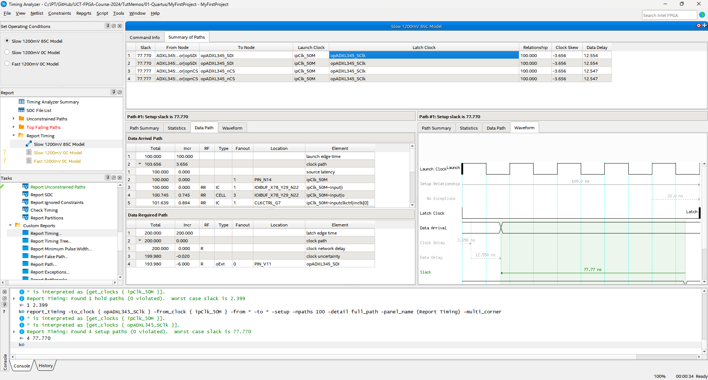

# Tutorial &ndash; Timing Constraints

Prerequisite: Day 2 lectures

The previous tutorials doesn't deal with timing constraints.
It's time to fix that.

--------------------------------------------------------------------------------

## Create an SDC file


It is customary to name it the same as your project, i.e. `MyFirstProject.sdc`.

### Constrain the JTAG port

These constraints are pretty standard for any Altera FPGA.  You can generally
simply copy-and-paste these lines into any new project.

```tcl
set_clock_groups -exclusive -group [get_clocks {altera_reserved_tck}]

set_input_delay  -clock altera_reserved_tck -clock_fall 3 [get_ports {altera_reserved_tdi}]
set_input_delay  -clock altera_reserved_tck -clock_fall 3 [get_ports {altera_reserved_tms}]
set_output_delay -clock altera_reserved_tck -clock_fall 3 [get_ports {altera_reserved_tdo}]
```

### Add the clocks

You've added a 50 MHz clock to drive the ADXL345.  Quartus needs to know about it:

```tcl
create_clock -name ipClk_50M -period 20 [get_ports ipClk_50M]
```

You can name the clock whatever you like,
but it is often convenient to name it the same as the pin.

The `derive_pll_clocks` and `derive_clock_uncertainty` commands will be used in
future tutorials and practicals, so we might as well add them now.  They
automatically add clocks generated by PLLs, including the clock jitter.

```tcl
derive_pll_clocks -create_base_clocks -use_net_name
derive_clock_uncertainty
```

### Constrain the external pins

At this point, Quartus is still complaining about unconstrained paths.
You can use the Timing Analyzer tool to list them:


**NOTE**: You do not need to recompile to update the timing analysis.  Simply
          reset the design and then re-run the analysis you're interested in.


### Concentrate on the ones we don't care about:

```tcl
set_false_path -from * -to [get_ports opLED*]
set_false_path -to * -from [get_ports ipSwitch*]
set_false_path -to * -from [get_ports ipnReset*]
```

### Now constrain the ADXL345 interface

Consult the ADXL345 datasheet and add the constraints.  Add a 1 ns uncertainty.

```tcl
create_clock -name opADXL345_SClk -period 200 [get_ports opADXL345_SClk]

set_output_delay -min -clock opADXL345_SClk             -6 [get_ports opADXL345_nCS]
set_output_delay -max -clock opADXL345_SClk              6 [get_ports opADXL345_nCS]
set_output_delay -min -clock opADXL345_SClk -clock_fall -6 [get_ports opADXL345_nCS] -add_delay
set_output_delay -max -clock opADXL345_SClk -clock_fall  6 [get_ports opADXL345_nCS] -add_delay

set_output_delay -min -clock opADXL345_SClk             -6 [get_ports opADXL345_SDI]
set_output_delay -max -clock opADXL345_SClk              6 [get_ports opADXL345_SDI]
set_output_delay -min -clock opADXL345_SClk -clock_fall -6 [get_ports opADXL345_SDI] -add_delay
set_output_delay -max -clock opADXL345_SClk -clock_fall  6 [get_ports opADXL345_SDI] -add_delay

set_input_delay  -min -clock opADXL345_SClk -clock_fall  0 [get_ports ipADXL345_SDO]
set_input_delay  -max -clock opADXL345_SClk -clock_fall 41 [get_ports ipADXL345_SDO]

set_multicycle_path -from [get_clocks opADXL345_SClk] \
                    -to   [get_clocks ipClk_50M] \
                    -setup 10 \

set_multicycle_path -from [get_clocks opADXL345_SClk] \
                    -to   [get_clocks ipClk_50M] \
                    -hold 9

set_multicycle_path -from [get_clocks ipClk_50M] \
                    -to   [get_clocks opADXL345_SClk] \
                    -start -setup 5

set_multicycle_path -from [get_clocks ipClk_50M] \
                    -to   [get_clocks opADXL345_SClk] \
                    -start -hold 4
```

Make sure you understand the origin of every line above.

--------------------------------------------------------------------------------

## Confirm the timing diagrams

Timing constraints are confusing and tricky to get right.  It is best to
confirm that the tool understands what you want, so ask the Timing Analyzer
tool to draw you the timing diagrams:


You can now use the TCL console to quickly run through all 4 options of data
direction and setup vs. hold.  Press `up` in the console to get to the
previous command, and then run each one:

```tcl
report_timing -from_clock { opADXL345_SClk } -to_clock { ipClk_50M } -from * -to * -setup -npaths 100 -detail full_path -panel_name {Report Timing} -multi_corner
report_timing -from_clock { opADXL345_SClk } -to_clock { ipClk_50M } -from * -to * -hold  -npaths 100 -detail full_path -panel_name {Report Timing} -multi_corner
report_timing -to_clock { opADXL345_SClk } -from_clock { ipClk_50M } -from * -to * -setup -npaths 100 -detail full_path -panel_name {Report Timing} -multi_corner
report_timing -to_clock { opADXL345_SClk } -from_clock { ipClk_50M } -from * -to * -hold  -npaths 100 -detail full_path -panel_name {Report Timing} -multi_corner
```



--------------------------------------------------------------------------------

