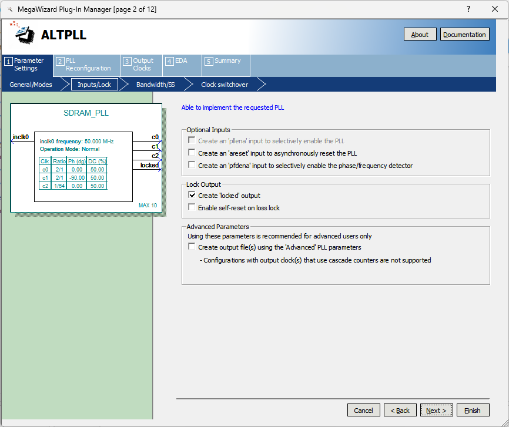
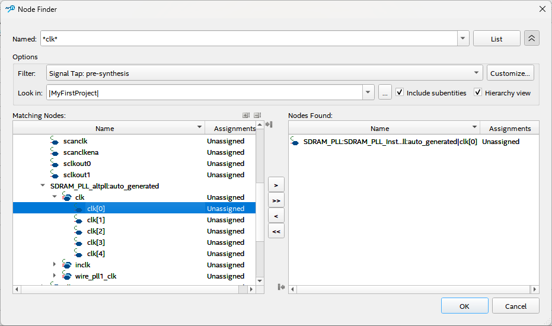

# Tutorial &ndash; SDRAM Controller

Prerequisite: Day 3 lectures

This tutorial hooks up the SDRAM IC,
and then analyses it using the Signal Tap Logic Analyser.

--------------------------------------------------------------------------------

## Create the clocks

The SDRAM IC has really tight timing requirements.  In order to meet these
requirements, you must create two 100 MHz clocks: one to drive the FPGA logic,
and another for the SDRAM device.  The device clock must lead the FPGA clock
by 90&deg; in order to compensate for the FPGA pin and PCB delays.

### Use the IP catalogue to generate a PLL module.


Call it `SDRAM_PLL` and set the source to 50 MHz on a speed-grade 7 device.


Make sure you have a `locked` output in order to drive the reset later.



You can set the bandwidth to `auto`.


You don't need a second input.


There is no need for dynamic reconfiguration.


Set the first output to 100 MHz, 0 phase.


Set the second output to 100 MHz, -90&deg; phase


We'll need a 780 kHz clock later, so you might as well add it now.


No more outputs are required.


You only need the `Variation file`, so feel free to deselect the others.


--------------------------------------------------------------------------------

## Hook up the PLL

```systemverilog
wire Clk_100M;
wire Clk_780k;
wire PLL_Locked;

SDRAM_PLL SDRAM_PLL_Inst(
  .inclk0(ipClk_50M),
  .c0    (Clk_100M),
  .c1    (opClk_SDRAM),
  .c2    (Clk_780k),
  .locked(PLL_Locked)
);
//------------------------------------------------------------------------------

reg Reset;
always @(posedge Clk_100M) Reset <= ~PLL_Locked || ~ipnReset;
//------------------------------------------------------------------------------
```

--------------------------------------------------------------------------------

## Use an existing SDRAM controller

If you feel really ambitious, you can write your own SDRAM controller.  The
datasheet is provided in the
[Github References](https://github.com/jpt13653903/UCT-FPGA-Course-2024/blob/master/Reference%20Material/Peripherals/IS42S16320D.pdf).
It is highly recommended, however, that you use an existing controller, such as
[jpt13653903/IS42S16320D-SDRAM](https://github.com/jpt13653903/IS42S16320D-SDRAM) on Github.

### Hook it up to your project

```systemverilog
module MyFirstProject(
  // ...

  output       opClk_SDRAM,
  output       opSDRAM_CKE,
  output       opSDRAM_nCS,
  output       opSDRAM_nRAS,
  output       opSDRAM_nCAS,
  output       opSDRAM_nWE,
  output [12:0]opSDRAM_A,
  output [ 1:0]opSDRAM_BA,
  output [ 1:0]opSDRAM_DQM,
  inout  [15:0]bpSDRAM_DQ,

  output reg [15:0]opReadData
);
//------------------------------------------------------------------------------

wire [24:0]Avalon_Address;
wire       Avalon_WaitRequest;

wire [15:0]Avalon_WriteData;
wire       Avalon_Write;

wire       Avalon_Read;
wire [15:0]Avalon_ReadData;
wire       Avalon_ReadDataValid;

IS42S16320D SDRAM_Inst(
  .ipClk          (Clk_100M),
  .ipReset        (Reset   ),

  .ipAddress      (Avalon_Address      ),
  .ipByteEnable   (2'b11               ),
  .opWaitRequest  (Avalon_WaitRequest  ),

  .ipWriteData    (Avalon_WriteData    ),
  .ipWrite        (Avalon_Write        ),

  .ipRead         (Avalon_Read         ),
  .opReadData     (Avalon_ReadData     ),
  .opReadDataValid(Avalon_ReadDataValid),

  .opCKE          (opSDRAM_CKE ),
  .opnCS          (opSDRAM_nCS ),
  .opnRAS         (opSDRAM_nRAS),
  .opnCAS         (opSDRAM_nCAS),
  .opnWE          (opSDRAM_nWE ),
  .opA            (opSDRAM_A   ),
  .opBA           (opSDRAM_BA  ),
  .opDQM          (opSDRAM_DQM ),
  .bpDQ           (bpSDRAM_DQ  )
);
//------------------------------------------------------------------------------
```

### Remember the pin mapping

```tcl
set_location_assignment PIN_U17 -to opSDRAM_A[0]
set_location_assignment PIN_W19 -to opSDRAM_A[1]
set_location_assignment PIN_V18 -to opSDRAM_A[2]
set_location_assignment PIN_U18 -to opSDRAM_A[3]
set_location_assignment PIN_U19 -to opSDRAM_A[4]
set_location_assignment PIN_T18 -to opSDRAM_A[5]
set_location_assignment PIN_T19 -to opSDRAM_A[6]
set_location_assignment PIN_R18 -to opSDRAM_A[7]
set_location_assignment PIN_P18 -to opSDRAM_A[8]
set_location_assignment PIN_P19 -to opSDRAM_A[9]
set_location_assignment PIN_T20 -to opSDRAM_A[10]
set_location_assignment PIN_P20 -to opSDRAM_A[11]
set_location_assignment PIN_R20 -to opSDRAM_A[12]
set_location_assignment PIN_Y21 -to bpSDRAM_DQ[0]
set_location_assignment PIN_Y20 -to bpSDRAM_DQ[1]
set_location_assignment PIN_AA22 -to bpSDRAM_DQ[2]
set_location_assignment PIN_AA21 -to bpSDRAM_DQ[3]
set_location_assignment PIN_Y22 -to bpSDRAM_DQ[4]
set_location_assignment PIN_W22 -to bpSDRAM_DQ[5]
set_location_assignment PIN_W20 -to bpSDRAM_DQ[6]
set_location_assignment PIN_V21 -to bpSDRAM_DQ[7]
set_location_assignment PIN_P21 -to bpSDRAM_DQ[8]
set_location_assignment PIN_J22 -to bpSDRAM_DQ[9]
set_location_assignment PIN_H21 -to bpSDRAM_DQ[10]
set_location_assignment PIN_H22 -to bpSDRAM_DQ[11]
set_location_assignment PIN_G22 -to bpSDRAM_DQ[12]
set_location_assignment PIN_G20 -to bpSDRAM_DQ[13]
set_location_assignment PIN_G19 -to bpSDRAM_DQ[14]
set_location_assignment PIN_F22 -to bpSDRAM_DQ[15]
set_location_assignment PIN_T21 -to opSDRAM_BA[0]
set_location_assignment PIN_T22 -to opSDRAM_BA[1]
set_location_assignment PIN_V22 -to opSDRAM_DQM[0]
set_location_assignment PIN_J21 -to opSDRAM_DQM[1]
set_location_assignment PIN_U22 -to opSDRAM_nRAS
set_location_assignment PIN_U21 -to opSDRAM_nCAS
set_location_assignment PIN_N22 -to opSDRAM_CKE
set_location_assignment PIN_L14 -to opClk_SDRAM
set_location_assignment PIN_V20 -to opSDRAM_nWE
set_location_assignment PIN_U20 -to opSDRAM_nCS

set_instance_assignment -name IO_STANDARD "3.3-V LVTTL" -to opClk_SDRAM
set_instance_assignment -name IO_STANDARD "3.3-V LVTTL" -to opSDRAM*
set_instance_assignment -name IO_STANDARD "3.3-V LVTTL" -to bpSDRAM*

set_instance_assignment -name CURRENT_STRENGTH_NEW 8MA -to opClk_SDRAM
set_instance_assignment -name CURRENT_STRENGTH_NEW 8MA -to opSDRAM*
set_instance_assignment -name CURRENT_STRENGTH_NEW 8MA -to bpSDRAM*

set_instance_assignment -name BOARD_MODEL_NEAR_C 3.5P -to opClk_SDRAM
set_instance_assignment -name BOARD_MODEL_NEAR_C 3.8P -to opSDRAM*
set_instance_assignment -name BOARD_MODEL_NEAR_C 6.0P -to bpSDRAM*
#-------------------------------------------------------------------------------

set_instance_assignment -name VIRTUAL_PIN ON -to opReadData*
#-------------------------------------------------------------------------------
```

The virtual `opReadData` port is required to prevent Quartus from optimising
away most of your circuit, because it's not connected to anything.  Once you
connect the SDRAM read port to something useful, you can remove this virtual port.

### Add timing constraints

Use the datasheet to figure out the timing requirements:

```tcl
create_generated_clock -source [get_pins { SDRAM_PLL_Inst|altpll_component|auto_generated|pll1|clk[1] } ] \
                       -name opClk_SDRAM [get_ports opClk_SDRAM]

# Suppose +- 100 ps skew
# Board Delay (Data) + Propagation Delay - Board Delay (Clock)
# max 5.4(max) +0.4(trace delay) +0.1 = 5.9
# min 2.7(min) +0.4(trace delay) -0.1 = 3.0

set_input_delay -max -clock opClk_SDRAM 5.9 [get_ports bpSDRAM*]
set_input_delay -min -clock opClk_SDRAM 3.0 [get_ports bpSDRAM*]

# shift-window (clk[0] is also 100 MHz, but with -90 deg phase shift)

set_multicycle_path -from [get_clocks opClk_SDRAM] \
                    -to   [get_clocks SDRAM_PLL:SDRAM_PLL_Inst|altpll:altpll_component|SDRAM_PLL_altpll:auto_generated|wire_pll1_clk[0] ] \
                    -setup 2

# Suppose +- 100 ps skew
# max : Board Delay (Data) - Board Delay (Clock) + tsu (External Device)
# min : Board Delay (Data) - Board Delay (Clock) - th (External Device)
# max  1.5 +0.1 =  1.6
# min -0.8 -0.1 = -0.9

set_output_delay -max -clock opClk_SDRAM  1.6 [get_ports { bpSDRAM* opSDRAM* }]
set_output_delay -min -clock opClk_SDRAM -0.9 [get_ports { bpSDRAM* opSDRAM* }]
#-------------------------------------------------------------------------------
```

Just like with the ADXL345 timing constraints, make sure you understand where
all the lines above come from.

--------------------------------------------------------------------------------

## Create a test circuit

Now that you have your SDRAM hooked up, you need something to test it.
So add a test circuit:

```systemverilog
typedef enum { Write, Read, Done } STATE;
STATE State;

always @(posedge Clk_100M) begin
  if(Reset) begin
    Avalon_Address   <= 0;
    Avalon_WriteData <= 0;
    Avalon_Write     <= 0;
    Avalon_Read      <= 0;

    State <= Write;

  end else if(~Avalon_WaitRequest) begin
    case(State)
      Write: begin
        if(Avalon_Address == 25'h1FF_FFFE) State <= Read;
        if(Avalon_Write) begin
          Avalon_Address   <= Avalon_Address + 1;
          Avalon_WriteData <= Avalon_Address[15:0] + 1;
        end
        Avalon_Write <= 1;
      end

      Read: begin
        Avalon_Write <= 0;
        if(Avalon_Address == 25'h1FF_FFFE) State <= Done;
        Avalon_Address <= Avalon_Address + 1;
        Avalon_Read <= 1;
      end

      Done: begin
        Avalon_Read  <= 0;
        Avalon_Write <= 0;
      end

      default:;
    endcase
  end

  if(Avalon_ReadDataValid) opReadData <= Avalon_ReadData;
end
//------------------------------------------------------------------------------
```

This should compile without any errors, including passing timing closure.

--------------------------------------------------------------------------------

## Test with Signal Tap Logic Analyzer

Now we need to test our SDRAM module, so create a Signal Tap Logic Analyzer instance:


### Set up the analyser clock

Click on the `...` next to the `Clock` text box, then find the clock.

You need to use the `Signal Tap: pre-systhesis` filter, so open up the options
by means of the chevron to the right of the `List` button.



The clock is sometimes difficult to find, so you can use the Timing Analyzer
to list the clock tree for you:


### Set up the other parameters

Use as much sample depth as the available on-chip memory allows, enable a
storage qualifier and use a sequential trigger:


### Add some signals

Double-click on the open area to add nodes:


### Add some state machine nodes

It is useful to have named nodes in the log, so add some:


The tool auto-detects the `Commands`:


### Enable Signal Tap

When you save the Signal Tap setup, it will ask you if you'd like to add it to
the project and enable it.  Say: "yes".

If you want to enable / disable it later, you can do so in the settings:


### Compile the project and load it onto the device

### Run the analyser

Set up a rising-edge trigger on the `ipWrite` port (right-click on the
condition) and start a single acquisition.  This will put it into a state
where it's "waiting for trigger".


Press the reset button (`KEY0` on the board) to trigger the test circuit.

### Zoom out

Right-click on the log to zoom out.


### Zoom in

Left-click to zoom in.


### Check the read cycle

Change the trigger to the rising edge of `ipRead` and trigger a new acquisition.


### Check the refresh cycle

Change the trigger so that it triggers on a refresh cycle somewhere in the middle of the read test:


### Use the storage qualifier

Set the trigger back to the rising edge of `ipWrite`, and set the storage
qualifier to only store samples when the command is `REF`.


### Make sure that the refresh cycles continue

Set the trigger to the `REF` command, without a storage qualifier, and log the
behaviour after the test circuit finished.  Then measure the number of clock
cycles between refresh cycles (752 cycles in the figure below).


--------------------------------------------------------------------------------

## Change the test circuit

The test circuit is not very useful in verifying the memory, because it writes
the same 16-bit sequence many times.  Change it to store 32-bit counters
instead (i.e. odd addresses store the least significant 16 bits, and even
addresses the most significant 16 bits) and verify that the SDRAM controller
is functioning correctly for all addresses.

You don't need to check the whole thing (obviously).  Do strategic spot-checks.

--------------------------------------------------------------------------------

