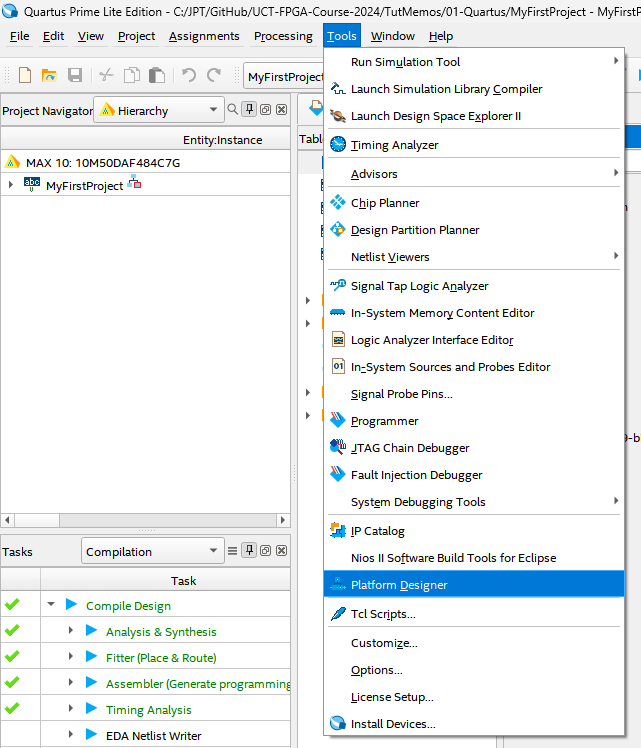
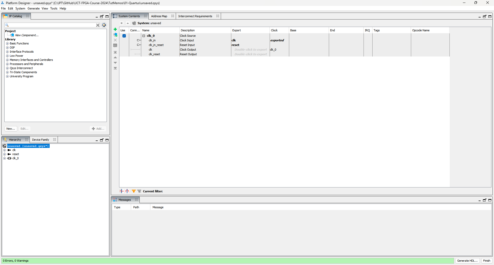
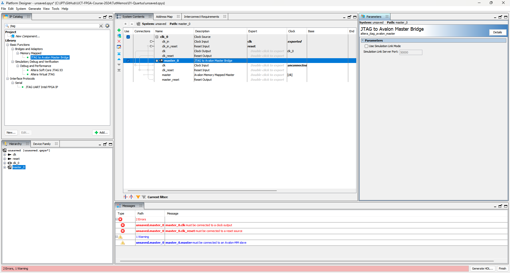
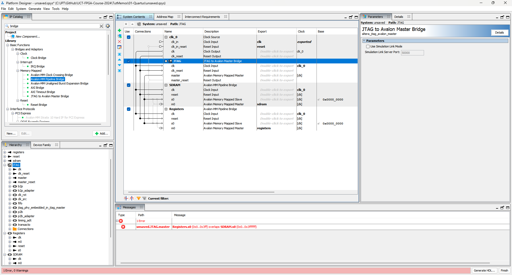
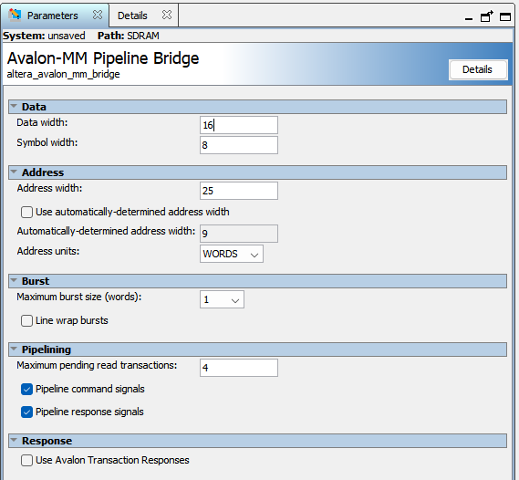
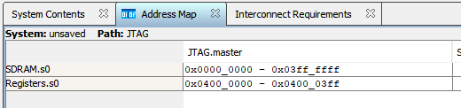
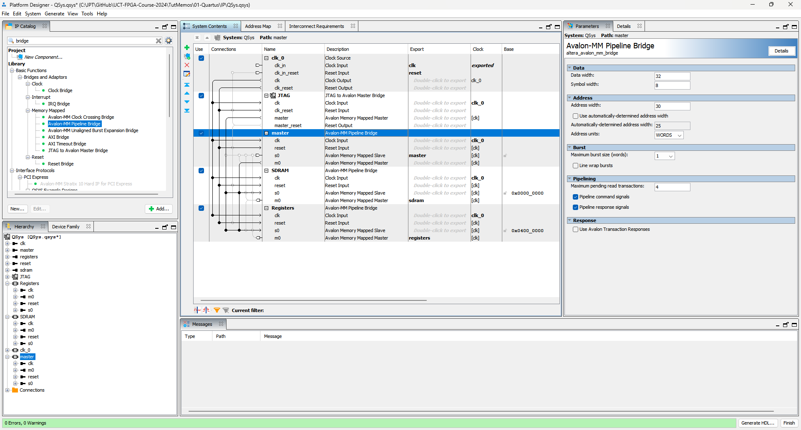
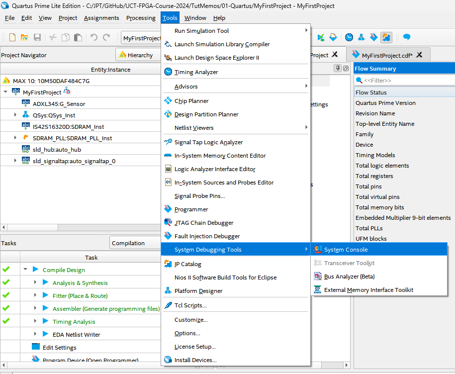
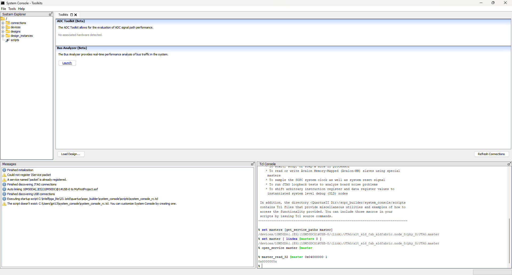

# Tutorial &ndash; Platform Designer

Prerequisite: Day 3 lectures

This tutorial goes through the creation of a QSys system, and then
controls it from the PC by means of the JTAG to Avalon Bridge.

--------------------------------------------------------------------------------

## Create a new QSys system

Open Platform Designer:



### This gives you a blank project:



### Add a JTAG to Avalon Master Bridge

Generally, the Platform Designer is used to set up an embedded microcontroller
to interface to various peripherals on the Avalon bus infrastructure.  For this
tutorial we'll use the JTAG to Avalon Master Bridge to serve the purpose of the
microcontroller.  This will allow us to control the device from the PC.



### Add more Avalon bridges

We want two peripheral: control registers and the SDRAM.
Add two pipeline bridges.  You can use `F2` to rename them.

Also connect them together and export the `Master` side of the bridges:



### Set up the bridge parameters

The SDRAM interface is 16-bit, so set it up as such:



We want 32-bit registers, so set it up as such:


### Set up the addresses

At this point, the two peripheral bridges are still overlapping in the master
address space.  Fix it:



### Add a second master

We also want the FPGA to be able to access the SDRAM, so add a second master:



### Click "Finish" to generate the QSys system

--------------------------------------------------------------------------------

## Hook up the system

Leave the second master idle for now, but hook up the rest.

```systemverilog
wire [29:0]Master_Address;
wire [ 3:0]Master_ByteEnable;
wire       Master_WaitRequest;
wire [31:0]Master_WriteData;
wire       Master_Write = 0;
wire       Master_Read  = 0;
wire [31:0]Master_ReadData;
wire       Master_ReadDataValid;

wire [ 7:0]Registers_Address;
wire [ 3:0]Registers_ByteEnable;
wire       Registers_WaitRequest;
wire [31:0]Registers_WriteData;
wire       Registers_Write;
wire       Registers_Read;
wire [31:0]Registers_ReadData;
wire       Registers_ReadDataValid;

wire [24:0]SDRAM_Address;
wire [ 1:0]SDRAM_ByteEnable;
wire       SDRAM_WaitRequest;
wire [15:0]SDRAM_WriteData;
wire       SDRAM_Write;
wire       SDRAM_Read;
wire [15:0]SDRAM_ReadData;
wire       SDRAM_ReadDataValid;

QSys QSys_Inst (
  .clk_clk                (Clk_100M               ), // In
  .reset_reset_n          (~Reset                 ), // In

  .master_address         (Master_Address         ), // In
  .master_byteenable      (Master_ByteEnable      ), // In
  .master_burstcount      (1                      ), // In
  .master_waitrequest     (Master_WaitRequest     ), // Out
  .master_writedata       (Master_WriteData       ), // In
  .master_write           (Master_Write           ), // In
  .master_read            (Master_Read            ), // In
  .master_readdata        (Master_ReadData        ), // Out
  .master_readdatavalid   (Master_ReadDataValid   ), // Out
  .master_debugaccess     (0                      ), // In

  .registers_address      (Registers_Address      ), // Out
  .registers_byteenable   (Registers_ByteEnable   ), // Out
  .registers_burstcount   (                       ), // Out
  .registers_waitrequest  (Registers_WaitRequest  ), // In
  .registers_writedata    (Registers_WriteData    ), // Out
  .registers_write        (Registers_Write        ), // Out
  .registers_read         (Registers_Read         ), // Out
  .registers_readdata     (Registers_ReadData     ), // In
  .registers_readdatavalid(Registers_ReadDataValid), // In
  .registers_debugaccess  (                       ), // Out

  .sdram_address          (SDRAM_Address          ), // Out
  .sdram_byteenable       (SDRAM_ByteEnable       ), // Out
  .sdram_burstcount       (                       ), // Out
  .sdram_waitrequest      (SDRAM_WaitRequest      ), // In
  .sdram_writedata        (SDRAM_WriteData        ), // Out
  .sdram_write            (SDRAM_Write            ), // Out
  .sdram_read             (SDRAM_Read             ), // Out
  .sdram_readdata         (SDRAM_ReadData         ), // In
  .sdram_readdatavalid    (SDRAM_ReadDataValid    ), // In
  .sdram_debugaccess      (                       )  // Out
);
```

--------------------------------------------------------------------------------

## Add some registers

You should pull the registers into a module of their own later.
For now, you can add them directly in the top level module.

```systemverilog
assign Registers_WaitRequest = 0;

always @(posedge Clk_100M) begin
  if(Reset) begin
    opLED <= 0;

  end else if(Registers_Write) begin
    case(Registers_Address)
      8'h01: begin
        if(Registers_ByteEnable[0]) opLED[7:0] <= Registers_WriteData[7:0];
        if(Registers_ByteEnable[1]) opLED[9:8] <= Registers_WriteData[9:8];
      end
    endcase
  end

  case(Registers_Address)
    8'h00: Registers_ReadData <= ipSwitch;
    8'h01: Registers_ReadData <= opLED;

    8'h10: Registers_ReadData <= { {16{G_Sensor_X[15]}}, G_Sensor_X };
    8'h11: Registers_ReadData <= { {16{G_Sensor_Y[15]}}, G_Sensor_Y };
    8'h12: Registers_ReadData <= { {16{G_Sensor_Z[15]}}, G_Sensor_Z };
  endcase
  Registers_ReadDataValid <= Registers_Read;
end
```

--------------------------------------------------------------------------------

## Use the System Console

The more official way to interface with the JTAG to Avalon Master Bridge is to
use the System Console.



This is a TCL console that you can use to execute scripts and automate the
debugging process.  It is not too user-friendly, however.



### Abstract with Python

Instead, we're going to interface using Python. Create a Python script as
shown below.  The basic premise is to open up the System Console in
command-line interface mode and then use Python to pipe commands to it.

```Python
"""
Python based abstraction for the Altera System Console interface
-----------------------------------------------------------------------------"""

import sys
import time
import subprocess
#-------------------------------------------------------------------------------

class SystemConsole:
    def __init__(self):
        command = 'C:/intelFPGA_lite/23.1std/quartus/sopc_builder/bin/system-console.exe --cli --disable_readline'
        sys.stdout.flush()
        self.console = subprocess.Popen(command, stdin=subprocess.PIPE, stdout=subprocess.PIPE)
        sys.stdout.flush()

    def __del__(self):
        self.console.kill()

    def dump_output(self):
        self.console.stdout.read1()

    def print_output(self):
        print(self.read_output()); sys.stdout.flush()

    def read_output(self):
        result = b''
        while True:
            out = self.console.stdout.read1(1)
            if out == b'%':
                # Read the space and exit
                out = self.console.stdout.read1(1)
                return bytes.decode(result, 'utf-8')
            else:
                result = result + out

    def cmd(self, cmd_string, verbose=True):
        if verbose:
            print(f'% {cmd_string}')
        self.console.stdin.write(bytes(f'{cmd_string}\n', 'utf-8'))
        self.console.stdin.flush()
#-------------------------------------------------------------------------------

print("Starting System Console..."); sys.stdout.flush()
fpga = SystemConsole()
fpga.print_output()

fpga.cmd('set masters [get_service_paths master]')
fpga.print_output()
fpga.cmd('set master [ lindex $masters 0 ]')
fpga.print_output()
fpga.cmd('open_service master $master')
fpga.print_output()

start = time.time()
for n in range(64):
    fpga.cmd('master_read_32 $master 0x04000000 1')
    fpga.print_output()
    fpga.cmd(f'master_write_32 $master 0x04000004 {n}')
    fpga.print_output()
end = time.time()
print(f'Verbose interface took {end - start} seconds'); sys.stdout.flush()

start = time.time()
for n in range(1024):
    fpga.cmd(f'master_write_32 $master 0x04000004 {n}', verbose=False)
    fpga.dump_output()
end = time.time()
print(f'Quiet write took {end - start} seconds'); sys.stdout.flush()

fpga.cmd(f'master_write_32 $master 0x04000004 0x55555555', verbose=False)
fpga.dump_output()

start = time.time()
fpga.cmd(f'master_write_32 $master 0x0 {{ 1 2 3 4 5 6 7 8 }}')
fpga.print_output()
end = time.time()
print(f'Writing 8 words took {end - start} seconds'); sys.stdout.flush()

fpga.cmd(f'master_read_32 $master 0x0 8')
fpga.print_output()

a = list(range(1024))
start = time.time()
fpga.cmd(f'master_write_32 $master 0x0 {{ {" ".join(map(str, a))} }}', verbose=True)
fpga.print_output()
end = time.time()
print(f'Writing 1024 words took {end - start} seconds'); sys.stdout.flush()
#-------------------------------------------------------------------------------
```

You'll notice that writing to SDRAM over this interface is really slow.
Don't worry &ndash; we'll make it faster later.

--------------------------------------------------------------------------------

## Abstract the registers

Now that you have the infrastructure working, add abstractions for reading and
writing registers:

```Python
def read_register(address):
    fpga.cmd(f'master_read_32 $master {0x04000000 + address*4} 1', verbose=False)
    return int(fpga.read_output().strip(), 0)

def write_register(address, value):
    fpga.cmd(f'master_write_32 $master {0x04000000 + address*4} {value}', verbose=False)
    fpga.dump_output()
#-------------------------------------------------------------------------------

print('\nRunning electronic level...'); sys.stdout.flush()
while True:
    X = read_register(0x10)
    Y = read_register(0x11)
    Z = read_register(0x12)

    if X & 0x80000000: X -= 0x100000000
    if Y & 0x80000000: Y -= 0x100000000
    if Z & 0x80000000: Z -= 0x100000000

    X //= 10;
    if X < -5: X = -5
    if X >  5: X =  5

    if X > 0: write_register(0x01, 0x30 >>  X)
    else:     write_register(0x01, 0x30 << -X)
#-------------------------------------------------------------------------------
```

--------------------------------------------------------------------------------

