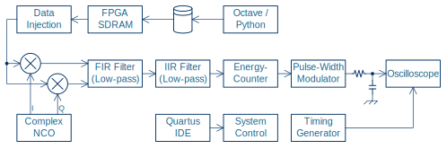
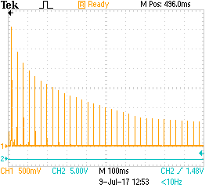
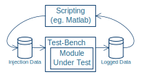

# Practical &ndash; FIR Filter

Prerequisite: Day 5 lectures

This practical implements the finite impulse response filter.

At the end, you'll be able to plot the spectrum
of various waveforms on an oscilloscope.

--------------------------------------------------------------------------------

## Filter Parameters

- 1024-point FIR filter that decimates by 128 (i.e. one sample output for every 128&nbsp;samples input)
- Use a cut-off frequency of 390&nbsp;kHz and a [Hann window](https://en.wikipedia.org/wiki/Window\_function\#Hann\_window) $w(n) = \sin^2\left(\frac{\pi n}{N-1}\right)$

--------------------------------------------------------------------------------

## Task List

- Design the FIR filter in Matlab / Python / Whatever and test using integer values
- Check for overflows, rounding problems, etc.
- Design what bit-widths to use, given the native RAM and DSP elements of the FPGA in question
- Use Matlab / Python / Whatever to generate the FIR filter constants and MIF file
- Verify through simulation
- Implement and integrate the FIR filter into the design, and test the system as a whole

--------------------------------------------------------------------------------

